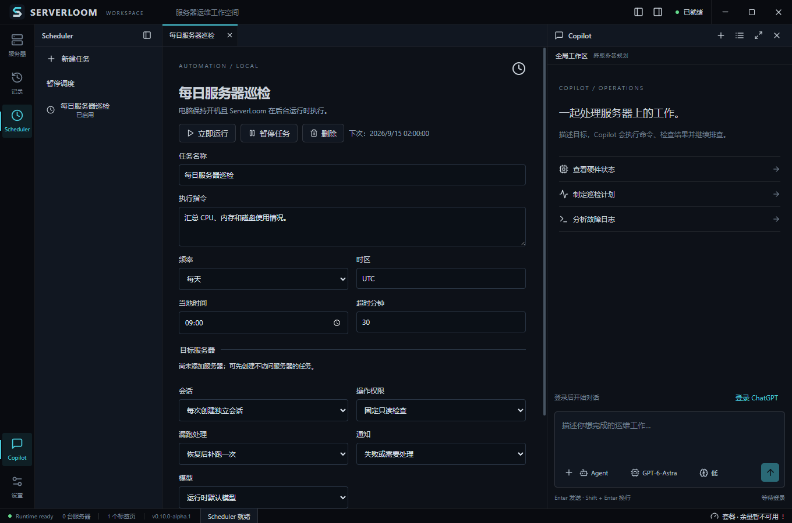

# ServerLoom

**A desktop workspace for AI-assisted server operations.**

ServerLoom brings your server inventory, SSH terminals, SFTP files, bandwidth monitoring and a Codex-powered Copilot into one Electron + Vue 3 app. The current alpha build is **0.10.0-alpha.3**, for Windows x64.

> Alpha software: start with a non-production server. Remote commands run with the permissions of your SSH account. This is an independent project, not an official OpenAI product.



## Download

Download the Windows installer (recommended for in-app updates) or portable ZIP from [Releases](https://github.com/CrxzyChen/serverloom/releases). For the portable edition, extract the **entire archive**, then run `ServerLoom.exe`; do not move the executable away from its resources folder.

The release includes the public upstream Codex 0.154.0 runtime. Sign in with your own supported account. Model access and usage limits depend on that account; no account, credentials, API keys or server connections are included.

## Features

- In-app updates: Stable/Alpha channels, download progress, restart coordination and preserved queued tasks. [Update behavior and publishing](docs/updates.md).
- Server inventory, groups, direct SSH/SFTP/bandwidth tabs and encrypted connection export/import.
- Independent Copilot panel with conversation history, Markdown, attachments, model/reasoning selectors and Agent/Plan modes.
- Native plan/goal status and account usage in the status bar, when supported by the runtime/account.
- Local Scheduler: once, interval, daily or weekly, explicit timezone, skip/catch-up-once policy and run history.
- One serial queue for manual and scheduled turns. Scheduled tasks can start a new conversation or resume an existing one.
- Fixed read-only scheduled checks or per-operation approval, with target-server restrictions.
- Tray operation, single instance, optional Windows login startup and hidden startup. Closing the window keeps tasks running; **Exit** stops the application.

## Quick start / 快速开始

1. Start ServerLoom and sign in to Codex.
2. Add a server, for example `demo-server`, `192.0.2.10`, SSH user `admin`. Replace these documentation values with your own connection details.
3. Choose an SSH Agent or select your private key locally. Private key bytes are not sent to the model. Verify the host fingerprint through your normal SSH workflow.
4. Click the server to open its overview; use its menu for SSH, files or bandwidth. Ask Copilot to perform work within the intended scope.
5. Open **Scheduler** to create a task. Keep the PC powered on and the application running; closing to tray is supported, shutting down the PC is not.

简体中文界面。服务器支持分组、直接打开终端和文件管理器；Copilot 可创建连接配置、执行运维任务和安排定时任务。托盘菜单提供暂停调度、打开窗口及完全退出。分享私钥时仅使用应用的加密连接包，并通过独立安全渠道传递口令。

## Development

Requirements: Windows x64, Node.js 22+, npm, and network access to GitHub for the public runtime download. The alpha is tested on Windows; other desktop platforms are not yet validated.

```sh
npm ci
npm run runtime:fetch
npm test
npm run build
npm run dev
```

`runtime:fetch` downloads the pinned **public** Codex release, verifies the archive SHA-256, and extracts only the four required executables. No desktop-app installation or private build is needed.

```sh
npm run notices
npm run privacy:check
npm run dist
npm run release:check
```

Live integration scripts under `scripts/` are opt-in. They may use your account quota or connect to a server; read the script and provide explicit test inputs. CI runs unit tests/build/privacy checks; the release workflow also builds distributable assets and creates a draft for tagged versions. SSH tests use `TEST_SSH_HOST`, `TEST_SSH_USER`, `TEST_SSH_KEY` or explicit CLI arguments; they never contain a real endpoint.

## Privacy and security

- Local account authentication, server inventory, private keys, attachments, run history and exports are **not part of this repository or release**.
- Application data lives in your OS application-data directory under `serverloom` and is separate from the portable installation. The alpha does not silently import another application's login data.
- Prompts, selected attachments and tool results may be sent to your model provider. Do not paste secrets into chat.
- General manual `servers_exec` can change remote systems. A local read-only sandbox does not sandbox a remote SSH account. Use restricted server accounts and review requested changes.
- Host-key verification is strict. Scheduled arbitrary commands require approval; fixed read-only tasks reject them. Interrupting SSH does not guarantee remote-process termination or rollback.
- The scheduler is a desktop background process, not a Windows service. Interrupted runs are recorded and never automatically replayed.
- Encrypted exports may include private keys **only when explicitly selected**; protect the file and passphrase accordingly.

See [SECURITY.md](SECURITY.md) for reporting guidance and [release validation](docs/alpha-release.md) for tested scope and limitations.

## License

ServerLoom is MIT licensed. Codex is distributed separately under its upstream Apache-2.0 license. Electron and other dependencies retain their own licenses; copies/notices are included in `resources/third-party` and the portable distribution. No ownership of third-party components is claimed.
